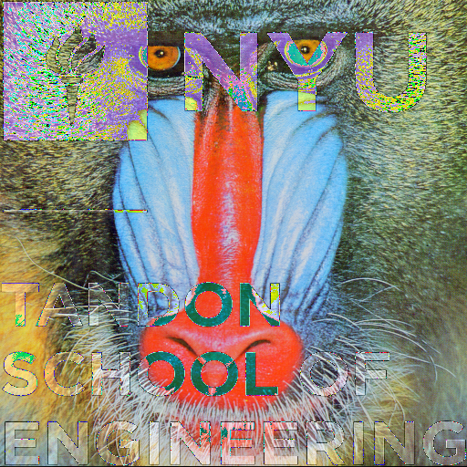
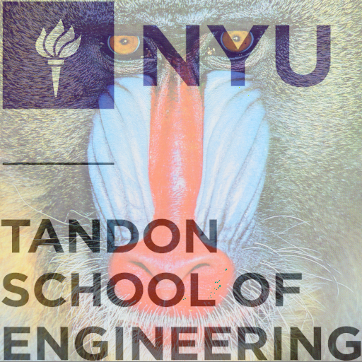
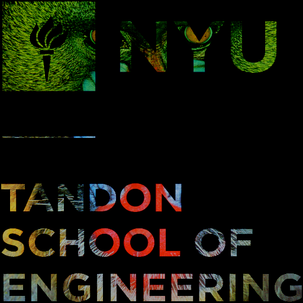
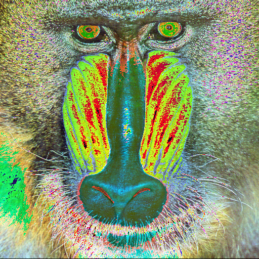
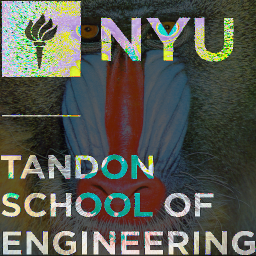
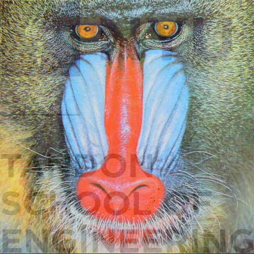

# CSGY6533
Adding test
Assignment of computer graphics
## Assignment 1
### Task Operations
For operations on image, the following pictures are adding, adding assignment, subtracting and multiplying. 

Adding

Adding assignment (With average, this is same to alpha 0.5)

subtracting

multiplying with 1.3

### Task Gamma Correction
The following shows gamma correction with 0.5

### Task Alpha Compositing
The following shows alpha compositing with 0.5 and 0.85

Alpha value 0.5 (This is same to adding with average)

Alpha value 0.85
